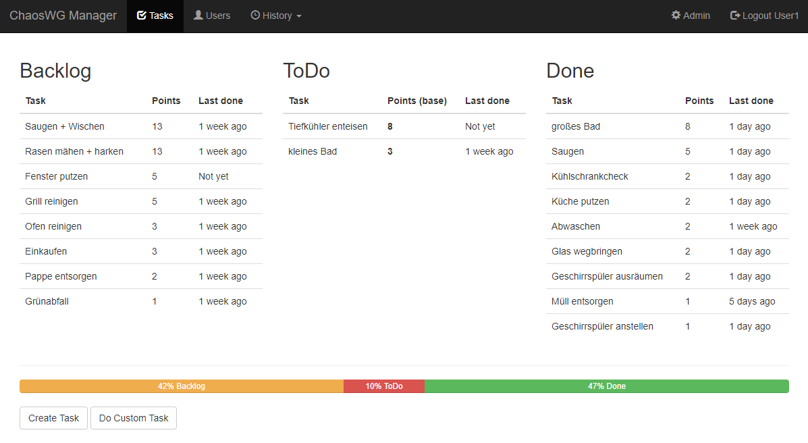

# ChaosWG-Manager
[](https://scrutinizer-ci.com/g/Obihoernchen/ChaosWG-Manager/build-status/master) [](https://scrutinizer-ci.com/g/Obihoernchen/ChaosWG-Manager/?branch=master)  [](https://github.com/Obihoernchen/ChaosWG-Manager/blob/master/LICENSE)

ChaosWG-Manager is a living community planner.

It's a Python 3.12+ WSGI app built with Flask 3, Peewee 4 and Bootstrap 5
(via [Bootstrap-Flask](https://github.com/greyli/bootstrap-flask)).



## Installation
### Requirements
Python **3.10+** is required (3.12+ recommended — the pinned
flask-admin/wtforms versions need it). Use a virtualenv:
```
python3 -m venv venv
venv/bin/pip install -r requirements.txt
```

Note: `wtf-peewee` is a direct dependency on purpose — flask-admin's
Peewee `ModelView` hard-imports it (there is no wtf-peewee-free admin
backend).

Afterwards you should create a `custom-config.py` file to overwrite the default secret keys of `config.py`.

### Run
For debugging/testing purposes simply execute `python3 run.py`.

For production use a proper WSGI server like Apache + mod_wsgi, Gunicorn, uWSGI, ...

This is a configuration example for Apache with mod_wsgi.
Edit user, group and paths, and put the following in a VirtualHost section.
```
WSGIDaemonProcess chaoswg user=<your_user> group=<your_group> threads=1 python-path=/srv/ChaosWG-Manager
WSGIScriptAlias / /srv/ChaosWG-Manager/chaoswg.wsgi
<Directory /srv/ChaosWG-Manager>
    WSGIProcessGroup chaoswg
    WSGIApplicationGroup %{GLOBAL}
    Require all granted
</Directory>
```
For more information and other examples see: [Flask Documentation](https://flask.palletsprojects.com/en/stable/deploying/)

## TODO
- use AJAX so we don't have to reload the whole page (single page with dynamic content)
- proper timezone support
- use jinja2 dictsort for tasks?
- delete task button
- optimize the users=User.get_all() on all templates (cache it or something).
- get task history from history table for each task and show in details (who did the task and when)
- y-axis left and right
- absence considerations
